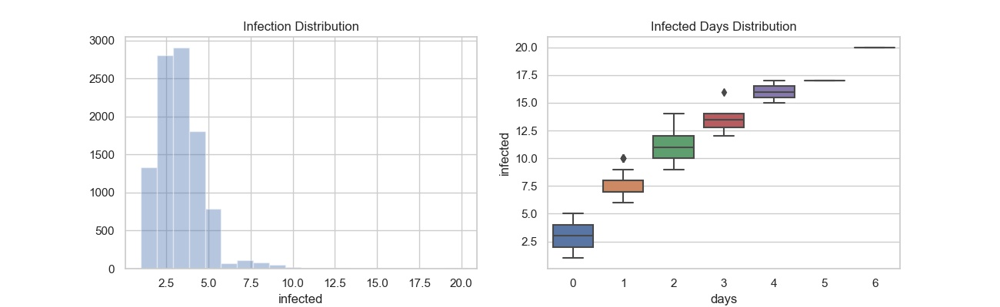

### Computer Project
#### Monte Carlo Methods
___

**Description:** Twenty computers are connected in a network. One computer becomes infected with a virus. Every day, this virus spreads from any infected computer to any uninfected computer with a probability 0.1. Also, every day, a computer technician takes 5 infected computers at random (or all infected computers, if their numbers is less than 5) and removes the virus from them. Estimate:

+ The expected time it takes to remove the virus from the whole network.
+ The probability that each computer gets infected at least once.
+ The expected number of computers that get infected.

**Theory:**
___
+ (a) 73 days
+ (b) 0.0012
+ (c) 3 
____
#### Simulation Instructions
____
+ **Program:** [simulation.py](simulation.py)

+ **How to use it:**
```bash
usage: simulation.py [-h] --simulations <integer> [--print-summary <boolean>]
                     [--csv-location <path>] [--computers <int>]
                     [--initial-infection <int>] [--prob <float>]
                     [--tech-threshold <int>]

Monte Carlo Methods

optional arguments:
  -h, --help            show this help message and exit

Required arguments:
  --simulations <integer>
                        Total number of simulations

Optional arguments:
  --print-summary <boolean>
                        print summary on screen
  --csv-location <path>
                        Directory location to save simulation results
  --computers <int>     Numbers of computers on the network
  --initial-infection <int>
                        Initial number of infected computers
  --prob <float>        Probability of a computer get infected
  --tech-threshold <int>
                        Numbers of computers a technical can fix by day
```
____
#### Examples
____
+ **Running 10.000 simulations** 
```bash
python simulation.py --simulations 10000

Monte Carlo Methods
    Applied Probability and Statistics for Computer Science - Spring 2020
    Georgia State University

Parameters:
    Total simulations.................................: 10000
    Print summary to screen...........................: True
    Directory location to save simulation results.....: output
    Numbers of computers on the network...............: 20
    Initial number of infected computers..............: 1
    Probability of a computer get infected............: 0.1
    Numbers of computers a technical can fix by day...: 5

Simulation 10000/10000
        The expected time it takes to remove the virus from the whole network...: 73 day(s)
        The probability that each computer gets infected at least once..........: 0.001
        The expected number of computers that get infected......................: 3
Simulation results saved at : output/2020-4-27-10-4-52.csv

Process completed in 173.306187 second(s)
```
____
#### Data Analysis
____
**Jupyter Notebook:** [DataAnalysis.ipynb](notebook/DataAnalysis.ipynb)


**Summary Statistics:**
| Total Simulation | Total Computers | Total Days infected | Min. Computers Infected | Avg. Computers Infected | Med. Computers Infected | Std. Computers Infected | Max. Computers Infected | Min. Day(s) Infected | Avg. Day(s) Infected | Med. Day(s) Infected | Std. Day(s) Infected | Max. Day(s) Infected | 
|------------------|-----------------|---------------------|-------------------------|-------------------------|-------------------------|-------------------------|-------------------------|----------------------|----------------------|----------------------|----------------------|----------------------| 
| 10000            | 20              | 724114              | 1                       | 20                      | 3.0                     | 1.6340981542359971      | 20                      | 0                    | 163307               | 0.0                  | 2810.6429871736104   | 163307               | 


**Distribution Analysis:**



    